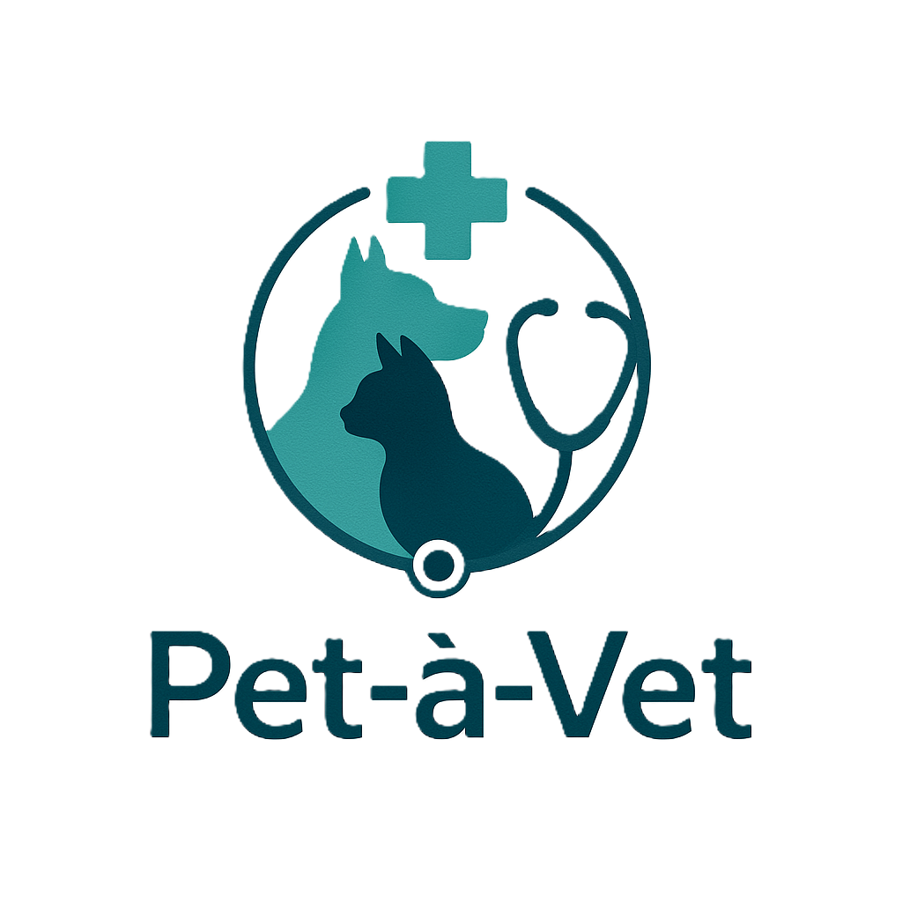

<!-- Improved compatibility of back to top link: See: https://github.com/othneildrew/Best-README-Template/pull/73 -->

<a id="readme-top"></a>

<!-- PROJECT LOGO -->
<br />
<div align="center">
  <a href="https://github.com/IBilba/Pet-a-Vet">
    
  </a>

  <p align="center">
    <strong>Ψηφιακή Πλατφόρμα για Κτηνιατρικές Υπηρεσίες</strong>
    <br />
    Ολοκληρωμένο σύστημα διαχείρισης κτηνιατρικών πρακτικών σχεδιασμένο για τον εξορθολογισμό των λειτουργιών κτηνιατρικών κλινικών, ιδιοκτητών κατοικίδιων και κτηνιάτρων.
    <br />
    <br />
    <a href="Pet-a-Vet.pdf">Δείτε την Τεκμηρίωση</a>
    ·
    <a href="https://github.com/IBilba/Pet-a-Vet/issues">Αναφορά Bug</a>
    ·
    <a href="https://github.com/IBilba/Pet-a-Vet/issues">Πρόταση Feature</a>
  </p>
</div>

[](LICENSE.md)
[](#)
[](#)
[](#)
[](#)

---

## Πίνακας Περιεχομένων

- [Σχετικά με το Έργο](#σχετικά-με-το-έργο)
- [Χαρακτηριστικά](#χαρακτηριστικά)
- [Αρχιτεκτονική Συστήματος](#αρχιτεκτονική-συστήματος)
- [Ρόλοι Χρηστών](#ρόλοι-χρηστών)
- [Τεχνολογική Στοίβα](#τεχνολογική-στοίβα)
- [Δομή Έργου](#δομή-έργου)
- [Εγκατάσταση & Ρύθμιση](#εγκατάσταση--ρύθμιση)
- [Τεκμηρίωση](#τεκμηρίωση)
- [Χάρτης Ανάπτυξης](#χάρτης-ανάπτυξης)
- [Ακαδημαϊκό Πλαίσιο](#ακαδημαϊκό-πλαίσιο)
- [Συνεισφορές](#συνεισφορές)
- [Άδεια Χρήσης](#άδεια-χρήσης)
- [Επικοινωνία](#επικοινωνία)

---

## Σχετικά με το Έργο

Το Pet-à-Vet είναι μια ολοκληρωμένη ψηφιακή πλατφόρμα για τη διαχείριση κτηνιατρικών πρακτικών που αναπτύχθηκε στο πλαίσιο του εργαστηριακού μαθήματος Τεχνολογίας Λογισμικού. Η πλατφόρμα στοχεύει να εξυπηρετήσει πολλαπλές ομάδες χρηστών συμπεριλαμβανομένων ιδιοκτητών κατοικίδιων, κτηνιατρικών κλινικών, προσωπικού κλινικών και επαγγελματιών εκτροφέων, προσφέροντας τόσο βασική δωρεάν λειτουργικότητα όσο και προηγμένα χαρακτηριστικά μέσω πακέτων συνδρομής.

### Προβληματισμός

Οι παραδοσιακές κτηνιατρικές πρακτικές αντιμετωπίζουν προκλήσεις με:

- Χειροκίνητο προγραμματισμό και διαχείριση ραντεβού
- Έγγραφα ιατρικά αρχεία
- Αναποτελεσματικότητες στη διαχείριση αποθέματος
- Περιορισμένη επικοινωνία μεταξύ κτηνιάτρων και ιδιοκτητών κατοικίδιων
- Έλλειψη ολοκληρωμένης επιχειρηματικής ανάλυσης

### Λύση

Το Pet-à-Vet παρέχει μια ολοκληρωμένη ψηφιακή λύση που:

- Εκσυγχρονίζει τις λειτουργίες κτηνιατρικών πρακτικών
- Βελτιώνει την παροχή υγειονομικής περίθαλψης κατοικίδιων
- Ενισχύει την επικοινωνία μεταξύ κτηνιάτρων και ιδιοκτητών κατοικίδιων
- Εξορθολογίζει τις επιχειρηματικές διαδικασίες και τη διαχείριση αποθέματος
- Παρέχει data-driven insights για καλύτερη λήψη αποφάσεων

<p align="right">(<a href="#readme-top">πίσω στην κορυφή</a>)</p>

---

## Χαρακτηριστικά

### 🚀 **Υλοποιημένα Βασικά Χαρακτηριστικά**

**Διαχείριση Χρηστών & Authentication:**

- ✅ Σύστημα πολλαπλών ρόλων (Administrator, Veterinarian, Secretary, Pet Groomer, Customer)
- ✅ Ασφαλές authentication βασισμένο σε cookies
- ✅ Role-based access control και permissions
- ✅ Σύστημα εγγραφής και σύνδεσης χρηστών
- ✅ Διαχείριση προφίλ χρηστών

**Διαχείριση Κατοικίδιων & Πελατών:**

- ✅ Ολοκληρωμένα προφίλ κατοικίδιων με ιατρικό ιστορικό
- ✅ Διαχείριση πληροφοριών πελατών
- ✅ Καταγραφή και παρακολούθηση κατοικίδιων
- ✅ Διαχείριση συνδρομών πελατών

**Σύστημα Ραντεβού:**

- ✅ Προγραμματισμός και διαχείριση ραντεβού
- ✅ Παρακολούθηση διαθεσιμότητας κτηνιάτρων
- ✅ Παρακολούθηση κατάστασης ραντεβού
- ✅ API διαθέσιμων χρονικών διαστημάτων

**Ιατρικά Αρχεία:**

- ✅ Ψηφιακή δημιουργία και διαχείριση ιατρικών αρχείων
- ✅ Παρακολούθηση ιατρικού ιστορικού
- ✅ Σημειώσεις και παρατηρήσεις κτηνιάτρων
- ✅ Τεκμηρίωση θεραπειών

**Dashboard & Analytics:**

- ✅ Διεπαφές dashboard ανάλογα με το ρόλο
- ✅ Μετρικές απόδοσης και στατιστικά
- ✅ Σύστημα αναφορών διαχείρισης
- ✅ Οπτικοποίηση δεδομένων σε πραγματικό χρόνο

**E-commerce & Store:**

- ✅ Διαχείριση καταλόγου προϊόντων
- ✅ Λειτουργικότητα καλαθιού αγορών
- ✅ Επεξεργασία και παρακολούθηση παραγγελιών
- ✅ Έτοιμη ενσωμάτωση πληρωμών
- ✅ Οργάνωση προϊόντων βάσει κατηγοριών

**Warehouse & Inventory:**

- ✅ Σύστημα διαχείρισης αποθέματος
- ✅ Παρακολούθηση επιπέδων αποθέματος
- ✅ Διαχείριση παραγγελιών για προμήθειες
- ✅ Αναφορές και ανάλυση αποθέματος

**Επικοινωνία & Ειδοποιήσεις:**

- ✅ Σύστημα ειδοποιήσεων email
- ✅ Αυτοματοποίηση email καλωσορίσματος
- ✅ Ειδοποιήσεις συστήματος
- ✅ Toast notification UI

### 🏗️ **Τεχνικά Χαρακτηριστικά**

**Database & Διαχείριση Δεδομένων:**

- ✅ MySQL database με custom ORM layer
- ✅ Connection pooling για απόδοση
- ✅ Σύστημα αρχικοποίησης και migration βάσης δεδομένων
- ✅ Ολοκληρωμένα μοντέλα δεδομένων για όλες τις οντότητες

**API & Integration:**

- ✅ RESTful API endpoints (27+ routes)
- ✅ Server-side validation
- ✅ Error handling και logging
- ✅ API authentication middleware

**UI/UX:**

- ✅ Responsive design με Tailwind CSS
- ✅ Υποστήριξη dark/light theme
- ✅ Accessible components με Radix UI
- ✅ Σύγχρονη, επαγγελματική διεπαφή
- ✅ Loading states και error handling

### 🔄 **Υπό Ανάπτυξη**

- 🔧 Βελτιωμένες αναφορές και analytics
- 🔧 Βελτιστοποίηση mobile responsiveness
- 🔧 Προηγμένη αναζήτηση και φιλτράρισμα
- 🔧 Αυτοματοποιημένα συστήματα backup
- 🔧 Παρακολούθηση απόδοσης

### 📋 **Σχεδιαζόμενα Χαρακτηριστικά**

- 📅 Ενσωμάτωση ημερολογίου
- 📊 Προηγμένο dashboard analytics

<p align="right">(<a href="#readme-top">πίσω στην κορυφή</a>)</p>

---

## Αρχιτεκτονική Συστήματος

### Υποστήριξη Πλατφόρμας

- **Web Application**: Συμβατή με Chrome, Firefox, Safari, Edge
- **Responsive Design**: Mobile-optimized διεπαφή χρήστη

### Απαιτήσεις Απόδοσης

- **Response Time**: <2 δευτερόλεπτα για τις περισσότερες λειτουργίες
- **Availability**: 24/7 λειτουργία με <1 ώρα downtime/μήνα
- **Concurrent Users**: Υποστήριξη πολλαπλών ταυτόχρονων χρηστών
- **Data Retention**: 5+ χρόνια αποθήκευσης ιστορικών δεδομένων

---

## Ρόλοι Χρηστών

Το σύστημα υποστηρίζει πολλαπλούς τύπους χρηστών με συγκεκριμένα δικαιώματα:

| Ρόλος                      | Ευθύνες                                                    | Επίπεδο Πρόσβασης       |
| -------------------------- | ---------------------------------------------------------- | ----------------------- |
| **Administrator**          | Διαχείριση συστήματος, διαχείριση χρηστών, πλήρης πρόσβαση | Πλήρες Σύστημα          |
| **Veterinarian**           | Ιατρικά αρχεία, ραντεβού, συνταγές                         | Ιατρικά & Κλινικά       |
| **Secretary/Receptionist** | Ραντεβού, εξυπηρέτηση πελατών, βασικά αρχεία               | Διοικητικά              |
| **Pet Groomer**            | Ραντεβού καλλωπισμού, υπηρεσίες φροντίδας κατοικίδιων      | Συγκεκριμένες Υπηρεσίες |
| **Pet Owner/Customer**     | Προφίλ κατοικίδιων, ραντεβού, αγορές                       | Προσωπικά Δεδομένα      |

---

## Τεχνολογική Στοίβα

### Τρέχουσα Υλοποίηση

Το Pet-à-Vet αναπτύσσεται ενεργά χρησιμοποιώντας σύγχρονες web τεχνολογίες:

**Frontend Framework:**

- **Next.js 15.2.4** - React framework με App Router
- **React 19** - Component-based UI library
- **TypeScript 5** - Type-safe development

**Styling & UI:**

- **Tailwind CSS 3.4.17** - Utility-first CSS framework
- **Radix UI** - Accessible component primitives
- **Shadcn/UI** - Pre-built component library
- **Lucide React** - Icon library
- **Next Themes** - Dark/light mode support

**Backend & API:**

- **Next.js API Routes** - Serverless API endpoints
- **MySQL2** - Database driver
- **Custom ORM Layer** - Database abstraction

**Authentication & Security:**

- **Custom Cookie-based Auth** - Ασφαλής διαχείριση sessions
- **bcryptjs** - Password hashing
- **Role-based Access Control** - Σύστημα δικαιωμάτων πολλαπλών ρόλων
- **Server Actions** - Ασφαλείς server-side λειτουργίες

**Database:**

- **MySQL** - Relational database
- **Custom Query Layer** - Database operations
- **Connection Pooling** - Βελτιστοποιημένες συνδέσεις βάσης δεδομένων

**Communication:**

- **Nodemailer** - Email notifications
- **Sonner** - Toast notifications

**Development Tools:**

- **ESLint** - Code linting
- **PostCSS** - CSS processing
- **Autoprefixer** - CSS vendor prefixes

### Επισκόπηση Αρχιτεκτονικής

```text
┌─────────────────┐    ┌─────────────────┐    ┌─────────────────┐
│   Frontend      │    │   Backend       │    │   Database      │
│   (Next.js)     │◄──►│   (API Routes)  │◄──►│   (MySQL)       │
│                 │    │                 │    │                 │
│ • React 19      │    │ • Server Actions│    │ • Custom ORM    │
│ • TypeScript    │    │ • Middleware    │    │ • Connection    │
│ • Tailwind CSS  │    │ • Authentication│    │   Pooling       │
│ • Radix UI      │    │ • Role Control  │    │ • Query Layer   │
└─────────────────┘    └─────────────────┘    └─────────────────┘
```

<p align="right">(<a href="#readme-top">πίσω στην κορυφή</a>)</p>

---

## Δομή Έργου

Η εφαρμογή Pet-à-Vet ακολουθεί μια σύγχρονη δομή Next.js 15 με σαφή διαχωρισμό ευθυνών:

```text
Pet-a-Vet/
├── pet-a-vet/                       # Κύρια Next.js εφαρμογή
│   ├── app/                         # Next.js App Router
│   │   ├── api/                     # API endpoints (27+ routes)
│   │   │   ├── appointments/        # Διαχείριση ραντεβού
│   │   │   ├── auth/                # Authentication endpoints
│   │   │   ├── customers/           # Διαχείριση πελατών
│   │   │   ├── medical-records/     # Medical record APIs
│   │   │   ├── pets/                # Διαχείριση κατοικίδιων
│   │   │   ├── store/               # E-commerce APIs
│   │   │   ├── warehouse/           # Διαχείριση αποθέματος
│   │   │   └── ...                  # Επιπλέον API routes
│   │   ├── dashboard/               # Προστατευμένες dashboard routes
│   │   │   ├── admin/               # Διεπαφή διαχειριστή
│   │   │   ├── appointments/        # UI διαχείρισης ραντεβού
│   │   │   ├── customers/           # UI διαχείρισης πελατών
│   │   │   ├── medical-records/     # Διεπαφή ιατρικών αρχείων
│   │   │   ├── pets/                # UI διαχείρισης κατοικίδιων
│   │   │   ├── warehouse/           # Διεπαφή αποθέματος
│   │   │   └── ...                  # Επιπλέον dashboard sections
│   │   ├── login/                   # Σελίδες authentication
│   │   ├── register/                # Εγγραφή χρηστών
│   │   ├── forgot-password/         # Password recovery
│   │   ├── store/                   # E-commerce frontend
│   │   ├── layout.tsx               # Root layout component
│   │   ├── page.tsx                 # Homepage
│   │   └── globals.css              # Global styles
│   ├── components/                  # Επαναχρησιμοποιήσιμα React components
│   │   ├── ui/                      # Base UI components (Shadcn/UI)
│   │   ├── db-initializer.tsx       # Database initialization component
│   │   ├── medical-record-form.tsx  # Medical records form
│   │   ├── medical-record-view.tsx  # Medical records viewer
│   │   ├── pet-form.tsx             # Pet registration form
│   │   ├── notifications.tsx        # Notification system
│   │   ├── theme-provider.tsx       # Theme context provider
│   │   ├── theme-toggle.tsx         # Dark/light mode toggle
│   │   └── ...                      # Feature-specific components
│   ├── contexts/                    # React Context providers
│   │   ├── auth-provider.tsx        # Authentication context
│   │   ├── theme-context.tsx        # Theme management
│   │   └── preferences-context.tsx  # User preferences
│   ├── hooks/                       # Custom React hooks
│   │   ├── use-debounce.ts          # Debouncing hook
│   │   ├── use-mobile.tsx           # Mobile detection
│   │   ├── use-performance.ts       # Performance monitoring
│   │   └── use-toast.ts             # Toast notifications
│   ├── lib/                         # Utility libraries και configurations
│   │   ├── db/                      # Database layer
│   │   │   ├── models/              # Data models και interfaces
│   │   │   ├── connection.ts        # Database connection pool
│   │   │   └── config.ts            # Database configuration
│   │   ├── services/                # Business logic services
│   │   ├── utils/                   # Utility functions
│   │   ├── auth.ts                  # Authentication logic
│   │   ├── auth-utils.ts            # Authorization utilities
│   │   ├── api-auth.ts              # API authentication
│   │   ├── role-access.ts           # Role-based access control
│   │   └── utils.ts                 # General utilities
│   ├── public/                      # Static assets
│   │   ├── Pet-a-vet-logo-transparent.png  # Main logo
│   │   ├── *.png                    # Product και pet images
│   │   └── placeholder.*            # Placeholder images
│   ├── scripts/                     # Development και deployment scripts
│   │   ├── database/                # Database management scripts
│   │   ├── debug/                   # Debugging utilities
│   │   └── README.md                # Scripts documentation
│   ├── styles/                      # Additional styling
│   │   └── globals.css              # Global CSS overrides
│   ├── tests/                       # Testing infrastructure
│   │   ├── unit/                    # Unit tests
│   │   ├── integration/             # Integration tests
│   │   ├── authentication/         # Auth-specific tests
│   │   ├── e2e/                     # End-to-end tests
│   │   ├── performance/             # Performance tests
│   │   ├── security/                # Security tests
│   │   ├── fixtures/                # Test data fixtures
│   │   ├── helpers/                 # Test utilities
│   │   ├── jest.config.js           # Jest configuration
│   │   ├── setup.ts                 # Test setup
│   │   └── README.md                # Testing documentation
│   ├── utils/                       # Application utilities
│   ├── middleware.ts                # Next.js middleware για auth
│   ├── components.json              # Shadcn/UI configuration
│   ├── next.config.mjs              # Next.js configuration
│   ├── tailwind.config.ts           # Tailwind CSS configuration
│   ├── tsconfig.json                # TypeScript configuration
│   ├── playwright.config.ts         # Playwright E2E testing
│   ├── postcss.config.mjs           # PostCSS configuration
│   ├── package.json                 # Dependencies και scripts
│   ├── package-lock.json            # NPM lock file
│   └── pnpm-lock.yaml              # PNPM lock file
├── Resources/                       # Οπτικά στοιχεία και διαγράμματα
│   ├── Final UI/                    # Τελικά UI screenshots
│   ├── Mockup Screens/              # UI/UX design mockups
│   ├── Robustness Diagram/          # Robustness diagrams
│   ├── Sequence Diagram/            # Sequence diagrams
│   ├── Domain-model-v*.png          # Domain model iterations
│   ├── Use-casel-v*.png             # Use case diagrams
│   ├── Pet-a-vet-logo*.png          # Logo variants
│   └── tests.png                    # Testing documentation
├── LICENSE.md                       # Άδεια έργου
├── Pet-a-Vet.pdf                    # Κύρια PDF τεκμηρίωση
├── Pet-a-Vet.tex                    # Κύρια LaTeX τεκμηρίωση
└── README.md                        # Αυτό το αρχείο
```

---

## Εγκατάσταση & Ρύθμιση

### Προαπαιτούμενα

Πριν από τη ρύθμιση του Pet-à-Vet, βεβαιωθείτε ότι έχετε εγκαταστήσει τα ακόλουθα:

- **Node.js** (v18 ή νεότερη)
- **npm** ή **pnpm** (package manager)
- **MySQL** (v8.0 ή νεότερη)
- **Git** (για κλωνοποίηση του repository)

### Ρύθμιση Περιβάλλοντος

1. **Κλωνοποίηση του repository**:

   ```bash
   git clone https://github.com/IBilba/Pet-a-Vet.git
   cd Pet-a-Vet/pet-a-vet
   ```

2. **Εγκατάσταση dependencies**:

   ```bash
   npm install --legacy-peer-deps
   # ή
   pnpm install
   ```

3. **Διαμόρφωση περιβάλλοντος**:
   Δημιουργήστε ένα αρχείο `.env.local` στον κύριο κατάλογο:

   ```env
   # Database Configuration
   DB_HOST=localhost
   DB_PORT=3306
   DB_NAME=petavet
   DB_USER=your_username
   DB_PASSWORD=your_password
   ```

4. **Ρύθμιση βάσης δεδομένων**:

   - Δημιουργήστε μια MySQL βάση δεδομένων με όνομα `pet_a_vet`
   - Η εφαρμογή θα αρχικοποιήσει αυτόματα τους πίνακες στην πρώτη εκτέλεση
   - Επισκεφθείτε `/api/db/init` για χειροκίνητη αρχικοποίηση της βάσης δεδομένων

5. **Εκκίνηση του development server**:

   ```bash
   npm run dev
   # ή
   pnpm dev
   ```

6. **Πρόσβαση στην εφαρμογή**:
   Ανοίξτε [http://localhost:3000](http://localhost:3000) στον browser σας

### Προεπιλεγμένοι Λογαριασμοί

Μετά την αρχικοποίηση της βάσης δεδομένων, μπορείτε να χρησιμοποιήσετε αυτούς τους προεπιλεγμένους λογαριασμούς:

**Administrator:**

- Email: `admin@petavet.com`
- Password: `password123`

**Veterinarian:**

- Email: `drsmith@petavet.com`
- Password: `password123`

**Secretary:**

- Email: `reception@petavet.com`
- Password: `password123`

**Pet Groomer:**

- Email: `groomer@petavet.com`
- Password: `password123`

**Customer:**

- Email: `john@example.com`
- Password: `password123`

### Διαθέσιμα Scripts

```bash
# Development
npm run dev          # Εκκίνηση development server
npm run build        # Build για production
npm run start        # Εκκίνηση production server

# Testing
npm run test         # Εκτέλεση όλων των tests
npm run test:watch   # Εκτέλεση tests σε watch mode
npm run test:coverage # Εκτέλεση tests με coverage report

# Code Quality
npm run lint         # Εκτέλεση ESLint
```

### Αντιμετώπιση Προβλημάτων

**Συνήθη Προβλήματα:**

1. **Σφάλμα Σύνδεσης Βάσης Δεδομένων**:

   - Επαληθεύστε ότι η MySQL εκτελείται
   - Ελέγξτε τα διαπιστευτήρια της βάσης δεδομένων στο `.env.local`
   - Βεβαιωθείτε ότι η βάση δεδομένων `pet_a_vet` υπάρχει

2. **Port Already in Use**:

   - Αλλάξτε το port: `npm run dev -- --port 3001`

3. **Module Not Found Errors**:

   - Καθαρίστε τα node_modules: `rm -rf node_modules && npm install`
   - Καθαρίστε το Next.js cache: `rm -rf .next`

4. **Προβλήματα Authentication**:
   - Επαληθεύστε ότι το `NEXTAUTH_SECRET` είναι ορισμένο στο `.env.local` - Καθαρίστε τα browser cookies για το localhost

<p align="right">(<a href="#readme-top">πίσω στην κορυφή</a>)</p>

---

## Τεκμηρίωση

### Τεχνική Τεκμηρίωση

1. **[API Documentation](pet-a-vet/docs/)** - Ολοκληρωμένη τεκμηρίωση API endpoints
2. **[Development Guide](pet-a-vet/docs/development/)** - Οδηγίες ρύθμισης και ανάπτυξης
3. **[Testing Guide](pet-a-vet/docs/testing/)** - Στρατηγικές testing και βέλτιστες πρακτικές
4. **[Database Schema](pet-a-vet/lib/db/models/)** - Μοντέλα δεδομένων και σχέσεις

### Ακαδημαϊκή Τεκμηρίωση

1. **[Project Reports](Pet-a-Vet.pdf)** - Ολοκληρωμένη τεκμηρίωση έργου

### Code Documentation

- **Type Definitions**: Ολοκληρωμένα TypeScript interfaces στο `pet-a-vet/lib/db/models/interfaces.ts`
- **API Routes**: Καλά τεκμηριωμένα endpoints στο `pet-a-vet/app/api/`
- **Component Library**: Επαναχρησιμοποιήσιμα components με τεκμηρίωση props
- **Utility Functions**: Helper functions με JSDoc σχόλια

### Database Schema

Η εφαρμογή χρησιμοποιεί ένα ολοκληρωμένο MySQL schema με τις ακόλουθες κύριες οντότητες:

- **Users**: Βασικός authentication και πληροφορίες προφίλ
- **Customers**: Εκτεταμένα προφίλ χρηστών για ιδιοκτήτες κατοικίδιων
- **Veterinarians**: Επαγγελματικά προφίλ με ειδικεύσεις
- **Pets**: Πλήρη προφίλ κατοικίδιων με ιατρικό ιστορικό
- **Appointments**: Σύστημα προγραμματισμού με παρακολούθηση διαθεσιμότητας
- **Medical Records**: Ψηφιακά αρχεία υγείας και ιστορικό θεραπειών
- **Products**: E-commerce απόθεμα και κατάλογος
- **Orders**: Διαχείριση αγορών και παραγγελιών
- **Inventory**: Διαχείριση αποθήκης και αποθέματος

---

## Χάρτης Ανάπτυξης

### Φάση 1: Θεμέλια & Αρχιτεκτονική ✅ (Ολοκληρώθηκε)

- [x] Ρύθμιση και διαμόρφωση έργου
- [x] Δομή εφαρμογής Next.js 15
- [x] Ενσωμάτωση TypeScript
- [x] Σχεδιασμός και μοντέλα βάσης δεδομένων
- [x] Υλοποίηση συστήματος authentication
- [x] Role-based access control

### Φάση 2: Βασικά Χαρακτηριστικά ✅ (Ολοκληρώθηκε)

- [x] Σύστημα διαχείρισης χρηστών
- [x] Εγγραφή και προφίλ κατοικίδιων
- [x] Σύστημα προγραμματισμού ραντεβού
- [x] Διαχείριση ιατρικών αρχείων
- [x] Διεπαφή διαχείρισης πελατών

### Φάση 3: Επιχειρηματικά Χαρακτηριστικά ✅ (Ολοκληρώθηκε)

- [x] Υλοποίηση e-commerce store
- [x] Διαχείριση αποθέματος και αποθήκης
- [x] Σύστημα επεξεργασίας παραγγελιών
- [x] Dashboard και analytics
- [x] Σύστημα ειδοποιήσεων

### Φάση 4: UI/UX & Testing ✅ (Ολοκληρώθηκε)

- [x] Υλοποίηση responsive design
- [x] Ενσωμάτωση component library (Radix UI)
- [x] Σύστημα θεμάτων (dark/light mode)
- [x] Ρύθμιση testing framework (Jest)
- [x] Δομή testing API endpoints

### Φάση 5: Βελτίωση & Βελτιστοποίηση 🔄

- [ ] Ρύθμιση παρακολούθησης απόδοσης
- [ ] Προηγμένο dashboard analytics
- [ ] Βελτιστοποίηση mobile responsiveness
- [ ] Βελτιώσεις ειδοποιήσεων email
- [ ] Βελτιώσεις αναζήτησης και φιλτραρίσματος

### Φάση 6: Προηγμένα Χαρακτηριστικά 📋

- [ ] Ειδοποιήσεις πραγματικού χρόνου (WebSockets)
- [ ] Ανάπτυξη mobile εφαρμογής
- [ ] Προηγμένες αναφορές και εξαγωγή δεδομένων
- [ ] Ενσωματώσεις τρίτων (payment gateways)
- [ ] Υποστήριξη πολλαπλών γλωσσών
- [ ] Συγχρονισμός ημερολογίου

### Φάση 7: Ετοιμότητα για Production 📋

- [ ] Security audit και penetration testing
- [ ] Βελτιστοποίηση απόδοσης και caching
- [ ] Συστήματα backup και ανάκαμψης βάσης δεδομένων
- [ ] Υλοποίηση CI/CD pipeline
- [ ] Διαμόρφωση deployment για production
- [ ] Συστήματα παρακολούθησης και logging

<p align="right">(<a href="#readme-top">πίσω στην κορυφή</a>)</p>

---

## Ακαδημαϊκό Πλαίσιο

Το Pet-à-Vet αναπτύσσεται στο πλαίσιο του μαθήματος **Εργαστήριο Τεχνολογίας Λογισμικού** στο **Πανεπιστήμιο Πατρών**, Τμήμα Μηχανικών Η/Υ και Πληροφορικής.

### Φάσεις Έργου

**Φάση Σχεδιασμού & Τεκμηρίωσης:**

- Ανάλυση απαιτήσεων με LaTeX τεκμηρίωση
- UML διαγράμματα και domain modeling
- Use case specifications και sequence diagrams
- Σχεδιασμός UI/UX με mockup screens

**Φάση Ανάπτυξης:**

- Υλοποίηση με Next.js 15 και TypeScript
- MySQL database με custom ORM layer
- RESTful API με 27+ endpoints
- Comprehensive testing με Jest και React Testing Library

---

## Συνεισφορές

Αυτό το έργο αναπτύσσεται προς το παρόν στο πλαίσιο ακαδημαϊκού μαθήματος. Οι εξωτερικές συνεισφορές δεν γίνονται δεκτές αυτή τη στιγμή.

### Ομάδα Ανάπτυξης

**Ακαδημαϊκό Έτος**: 2024-2025  
**Μάθημα**: Εργαστήριο Τεχνολογίας Λογισμικού  
**Ίδρυμα**: Πανεπιστήμιο Πατρών  
**Τμήμα**: Μηχανικών Η/Υ και Πληροφορικής

### Κορυφαίοι Συνεισφέροντες

<a href="https://github.com/IBilba/Pet-a-Vet/graphs/contributors">
  
</a>

<p align="right">(<a href="#readme-top">πίσω στην κορυφή</a>)</p>

---

## Άδεια Χρήσης

**Όλα τα Δικαιώματα Διατηρούνται** - Copyright © 2025 Pet-à-Vet Team

Αυτό το λογισμικό και η σχετική τεκμηρίωση είναι ιδιόκτητα και αναπτύχθηκαν για εκπαιδευτικούς σκοπούς. Δείτε το [LICENSE.md](LICENSE.md) για λεπτομερείς όρους.

<p align="right">(<a href="#readme-top">πίσω στην κορυφή</a>)</p>

---

## Επικοινωνία

Για ακαδημαϊκές ερωτήσεις σχετικά με αυτό το έργο:

- **Ίδρυμα**: Πανεπιστήμιο Πατρών
- **Τμήμα**: Μηχανικών Η/Υ και Πληροφορικής
- **Μάθημα**: Εργαστήριο Τεχνολογίας Λογισμικού

**Project Link**: [https://github.com/IBilba/Pet-a-Vet](https://github.com/IBilba/Pet-a-Vet)

<p align="right">(<a href="#readme-top">πίσω στην κορυφή</a>)</p>

---

## Ευχαριστίες

Ιδιαίτερες ευχαριστίες σε:

- Τους διδάσκοντες του Εργαστηρίου Τεχνολογίας Λογισμικού για την καθοδήγηση και υποστήριξη
- Το Τμήμα Μηχανικών Η/Υ και Πληροφορικής του Πανεπιστημίου Πατρών
- Την κοινότητα ανοιχτού κώδικα για τα εξαιρετικά εργαλεία και frameworks που χρησιμοποιήθηκαν

---

**Κατάσταση Έργου**: Αυτό είναι ένα πλήρως λειτουργικό σύστημα διαχείρισης κτηνιατρικών πρακτικών που αναπτύχθηκε για εκπαιδευτικούς σκοπούς στο πλαίσιο ενός μαθήματος software engineering. Το σύστημα επιδεικνύει ολοκληρωμένες δεξιότητες full-stack development και σύγχρονη αρχιτεκτονική web εφαρμογών.
