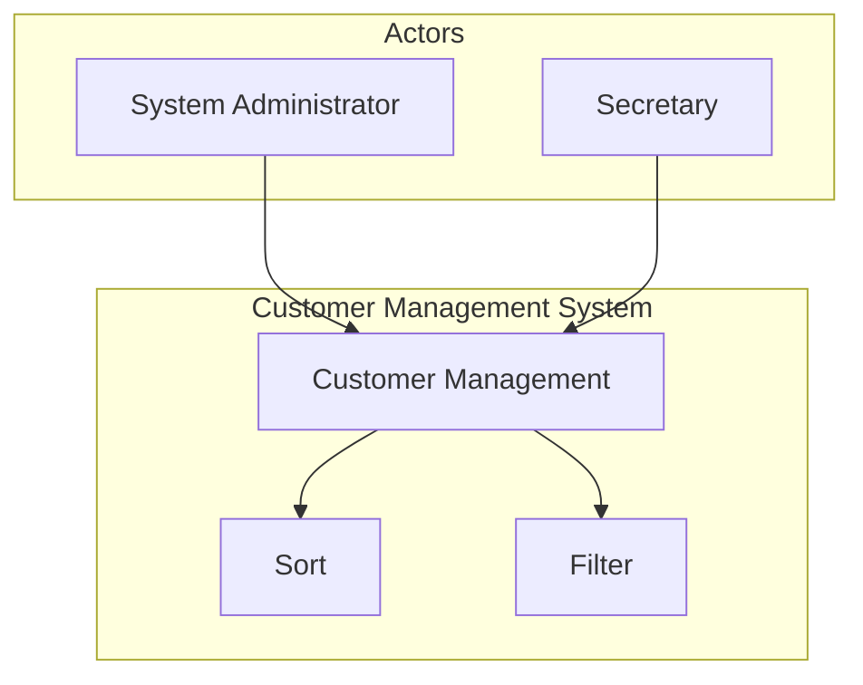

```mermaid
graph TB
    subgraph Actors
        Admin[System Administrator]
        Secretary[Secretary]
    end

    subgraph Customer Management System
        CM[Customer Management]
        S[Sort]
        F[Filter]
    end

    Admin --> CM
    Secretary --> CM

    CM --> S
    CM --> F

    click CM call linkCallback("d:/Documents/GitHub/Pet-a-Vet/Use Cases/Use-case-v0.1.tex#L411")
    click S call linkCallback("d:/Documents/GitHub/Pet-a-Vet/Use Cases/Use-case-v0.1.tex#L565")
    click F call linkCallback("d:/Documents/GitHub/Pet-a-Vet/Use Cases/Use-case-v0.1.tex#L632")
```