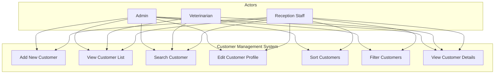

```mermaid
graph TB
    subgraph Actors
        A1[Admin]
        A2[Veterinarian]
        A3[Reception Staff]
    end

    subgraph Customer Management System
        UC1[Add New Customer]
        UC2[View Customer List]
        UC3[Search Customer]
        UC4[Edit Customer Profile]
        UC5[Sort Customers]
        UC6[Filter Customers]
        UC7[View Customer Details]
    end

    A1 --> UC1
    A1 --> UC2
    A1 --> UC3
    A1 --> UC4
    A1 --> UC5
    A1 --> UC6
    A1 --> UC7

    A2 --> UC2
    A2 --> UC3
    A2 --> UC7

    A3 --> UC1
    A3 --> UC2
    A3 --> UC3
    A3 --> UC4
    A3 --> UC5
    A3 --> UC6
    A3 --> UC7

click UC1 call linkCallback("c:/Users/biovo/Desktop/GitHub Projects/Pet-a-Vet/Use Cases/Use-case-v0.1.tex#L28")
click UC2 call linkCallback("c:/Users/biovo/Desktop/GitHub Projects/Pet-a-Vet/Use Cases/Use-case-v0.1.tex#L39")
click UC3 call linkCallback("c:/Users/biovo/Desktop/GitHub Projects/Pet-a-Vet/Use Cases/Use-case-v0.1.tex#L55")
click UC4 call linkCallback("c:/Users/biovo/Desktop/GitHub Projects/Pet-a-Vet/Use Cases/Use-case-v0.1.tex#L64")
click UC5 call linkCallback("c:/Users/biovo/Desktop/GitHub Projects/Pet-a-Vet/Use Cases/Use-case-v0.1.tex#L73")
click UC6 call linkCallback("c:/Users/biovo/Desktop/GitHub Projects/Pet-a-Vet/Use Cases/Use-case-v0.1.tex#L79")
click UC7 call linkCallback("c:/Users/biovo/Desktop/GitHub Projects/Pet-a-Vet/Use Cases/Use-case-v0.1.tex#L107")
```
