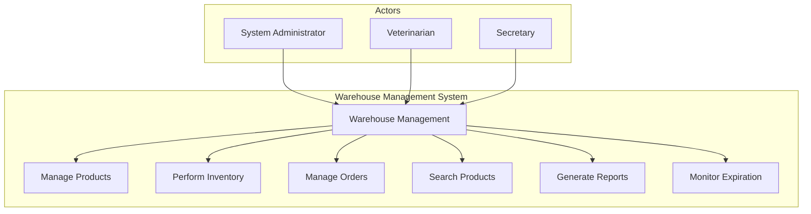

```mermaid
graph TB
    subgraph Actors
        Admin[System Administrator]
        Vet[Veterinarian]
        Secretary[Secretary]
    end

    subgraph Warehouse Management System
        WM[Warehouse Management]
        P[Manage Products]
        I[Perform Inventory]
        O[Manage Orders]
        S[Search Products]
        R[Generate Reports]
        E[Monitor Expiration]
    end

    Admin --> WM
    Vet --> WM
    Secretary --> WM

    WM --> P
    WM --> I
    WM --> O
    WM --> S
    WM --> R
    WM --> E

    click WM call linkCallback("c:/Users/biovo/Desktop/GitHub Projects/Pet-a-Vet/Use Cases/Use-case-v0.1.tex#L567")
    click P call linkCallback("c:/Users/biovo/Desktop/GitHub Projects/Pet-a-Vet/Use Cases/Use-case-v0.1.tex#L628")
    click I call linkCallback("c:/Users/biovo/Desktop/GitHub Projects/Pet-a-Vet/Use Cases/Use-case-v0.1.tex#L651")
    click O call linkCallback("c:/Users/biovo/Desktop/GitHub Projects/Pet-a-Vet/Use Cases/Use-case-v0.1.tex#L661")
    click S call linkCallback("c:/Users/biovo/Desktop/GitHub Projects/Pet-a-Vet/Use Cases/Use-case-v0.1.tex#L642")
    click R call linkCallback("c:/Users/biovo/Desktop/GitHub Projects/Pet-a-Vet/Use Cases/Use-case-v0.1.tex#L689")
    click E call linkCallback("c:/Users/biovo/Desktop/GitHub Projects/Pet-a-Vet/Use Cases/Use-case-v0.1.tex#L680")
```
