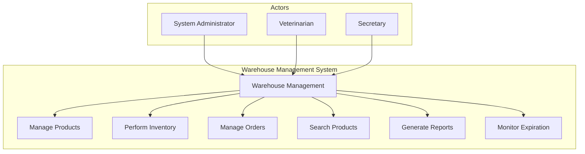

```mermaid
graph TB
    subgraph Actors
        Admin[System Administrator]
        Vet[Veterinarian]
        Secretary[Secretary]
    end

    subgraph Warehouse Management System
        WM[Warehouse Management]
        P[Manage Products]
        I[Perform Inventory]
        O[Manage Orders]
        S[Search Products]
        R[Generate Reports]
        E[Monitor Expiration]
    end

    Admin --> WM
    Vet --> WM
    Secretary --> WM

    WM --> P
    WM --> I
    WM --> O
    WM --> S
    WM --> R
    WM --> E
```
